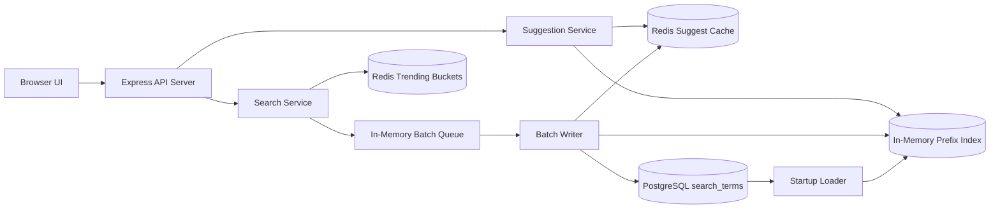

# Architecture

This document describes the implemented local architecture of PrefixPulse.

## Local Deployment

PrefixPulse is a local assignment project with:

- one Node.js + TypeScript + Express server
- one PostgreSQL database
- one Redis instance
- one in-memory Prefix Index inside the app process

The frontend is plain HTML/CSS/JavaScript served from `public/`.

## Mermaid Diagram



## Request Paths

Main API routes:

- `GET /api/health`
- `GET /api/suggest`
- `POST /api/search`
- `GET /api/trending`
- `GET /api/metrics`
- `GET /api/cache-routing`

## Suggestion Read Path

1. The browser calls `GET /api/suggest?q=<prefix>&limit=<n>`.
2. The server normalizes the prefix by lowercasing, trimming, and collapsing whitespace.
3. Redis is checked first with the cache-key format `suggest:<prefix>:<limit>`.
4. If Redis has a cached payload, the response is returned with `source: "cache"`.
5. If Redis misses, the server reads from the in-memory Prefix Index and returns `source: "index"`.
6. The result is written back to Redis with TTL-based caching.

Empty-prefix behavior:

- if `q` is empty, the service returns popular searches from the in-memory index

## Search Write Path

1. The browser calls `POST /api/search`.
2. The query is normalized.
3. The query is added to the in-memory batch queue.
4. Redis trending buckets are updated immediately.
5. The API responds with `202 Accepted`.
6. The batch writer flushes later on timer or batch-size threshold.

## Prefix Index Design

The implemented Prefix Index uses:

```text
Map<string, Suggestion[]>
```

For each normalized query:

- all prefixes from the first character to the full query are generated
- each prefix stores only the top `K` suggestions
- suggestions are sorted by descending count, then ascending query text

Why this design fits the assignment:

- it is simpler to explain than a Trie
- lookup is a direct map access
- memory stays bounded by per-prefix truncation

## Redis Usage

Redis is used for two purposes:

- caching suggestion responses
- storing recent trending activity in sorted-set buckets

Redis is not the source of truth for persistent counts. PostgreSQL remains the durable store.

## PostgreSQL Usage

PostgreSQL stores normalized queries in the `search_terms` table with:

- `query`
- `count`
- `recent_score`
- `updated_at`

The seed script loads the initial dataset from `data/search_queries.csv`, and the batch writer updates counts later through UPSERT-based writes.

## Batch Writer

The batch queue is stored in memory as aggregated query increments.

Flush triggers:

- every `FLUSH_INTERVAL_MS`
- immediately when distinct queued queries reach `BATCH_SIZE`

During a flush:

1. Aggregated updates are written to PostgreSQL.
2. Updated terms are pushed back into the Prefix Index.
3. Redis suggestion cache keys matching affected prefixes are invalidated.

Tradeoff:

- batching reduces repeated row updates
- suggestion counts may lag slightly until the next successful flush

## Trending Design

Trending uses Redis sorted-set buckets over a recent time window.

- each accepted search increments the current time bucket
- old buckets expire automatically
- `GET /api/trending` reads recent buckets, aggregates scores, and ranks results
- Prefix Index counts are used only as a tie-breaker when recent scores match

This keeps trending responsive to recent activity instead of lifetime popularity only.

## Health and Metrics

- `GET /api/health` returns a simple health payload
- `GET /api/metrics` returns counters for requests, cache hits/misses, queue depth, and batch flushes

These endpoints are helpful for local validation and benchmark observation.

## Consistent Hashing Simulation

`GET /api/cache-routing` is an HLD demo endpoint.

It shows how a cache key such as `suggest:iph:10` could be routed across logical cache nodes:

- `cache-node-a`
- `cache-node-b`
- `cache-node-c`

Important boundary:

- the local app still uses one Redis instance
- the cache-routing result is explanatory only
- the live `GET /api/suggest` path does not use the consistent-hash ring

## Failure Handling

Implemented resilience:

- if Redis suggestion lookup fails, the app falls back to the Prefix Index
- if Redis cache write fails, the suggestion result is still returned
- if Redis trending update fails, the search is still accepted and queued
- if a batch flush fails, queued updates are restored in memory for retry

Known limitation:

- queued writes are not durable until a batch flush succeeds

