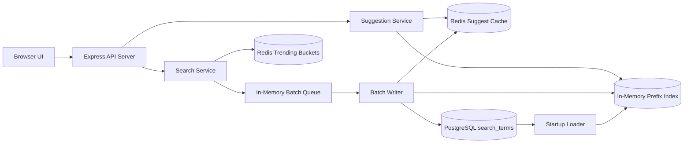

# Architecture

## Mermaid Diagram



## Read Path

1. The browser calls `GET /api/suggest`.
2. The API normalizes the prefix with lowercase, trim, and whitespace collapsing.
3. Redis is checked first using the key format `suggest:<prefix>:<limit>`.
4. On a cache hit, the API returns the cached payload with `source: "cache"`.
5. On a cache miss, the API falls back to the in-memory Prefix Index and returns `source: "index"`.
6. The response is written back to Redis with a configurable TTL.

## Write Path

1. The browser calls `POST /api/search`.
2. The API normalizes the query.
3. The normalized query is added to an in-memory batch queue.
4. Redis recent-trending buckets are updated immediately.
5. The API responds quickly with `queued: true`.
6. The batch writer flushes later based on time or queue size.

## Cache Path Explanation

- Prefix suggestions are cached in Redis for repeated reads.
- Empty-prefix requests return popular suggestions from the in-memory top list and are cached too.
- After a batch flush, the application invalidates Redis keys for prefixes affected by the updated queries.
- This keeps the read path fast while limiting stale suggestion windows to the batch interval plus cache TTL.

## Batch Writer Explanation

The batch writer keeps a `Map<query, countIncrement>` in memory.

Flush conditions:

- every `FLUSH_INTERVAL_MS`
- immediately when queued distinct queries reach `BATCH_SIZE`

During a flush:

1. Duplicate queries in the queue are already aggregated by the map.
2. A single PostgreSQL UPSERT statement updates `count` and `recent_score`.
3. Updated rows are pushed back into the Prefix Index.
4. Redis prefix-cache keys for the changed prefixes are invalidated.

Tradeoff:

- Benefit: fewer database writes and less repeated UPSERT work under bursty traffic.
- Cost: counts in suggestions are not perfectly fresh until the next batch flush completes.

## Prefix Index Explanation

The submitted implementation uses a Prefix Index:

```text
Map<string, Suggestion[]>
```

For each normalized query:

- generate all prefixes from the first character up to the full query
- store only the top `K` suggestions for each prefix
- keep suggestions sorted by descending total count

Why this choice:

- easier to explain than a Trie in a student assignment
- fast prefix lookups because the read path is a direct map access
- predictable memory growth because each prefix list is truncated

Alternatives not implemented in code:

- Trie
- Radix Tree

## Trending Search Explanation

Trending uses Redis sorted sets grouped into time buckets.

- On every search, the system increments the current bucket key.
- Older buckets expire automatically.
- `GET /api/trending` reads recent buckets, sums scores across the configured window, and ranks queries by recent score.
- Total count from the Prefix Index is used as a tie-breaker when recent scores match.

Why this helps:

- recent activity matters more than lifetime popularity
- the UI can surface what users are searching for now, not only what has always been searched

